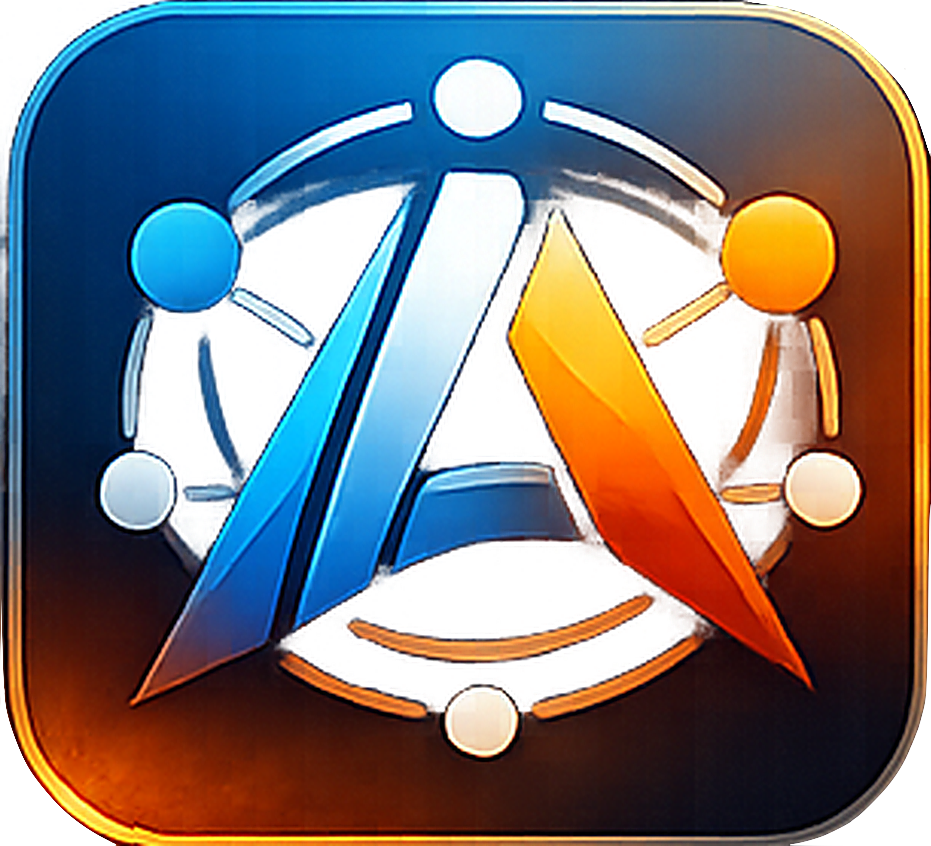
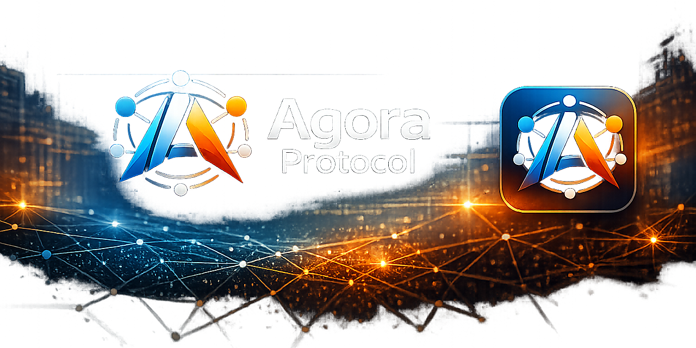

<p align="center">
  
</p>

<h1 align="center">Agora Protocol</h1>

<p align="center">
  <strong>A control plane for AI agents working on your codebase</strong>
</p>

<p align="center">
  
</p>

<p align="center">
  <a href="#what-is-agora">What is Agora?</a> &bull;
  <a href="#why-agora">Why Agora?</a> &bull;
  <a href="#quick-start">Quick Start</a> &bull;
  <a href="#cli-reference">CLI</a> &bull;
  <a href="#http-api">API</a> &bull;
  <a href="#mcp-integration">MCP</a> &bull;
  <a href="#architecture">Architecture</a> &bull;
  <a href="#security">Security</a> &bull;
  <a href="#roadmap">Roadmap</a> &bull;
  <a href="#license">License</a>
</p>

---

## What is Agora?

Agora is a **local-first control plane** that lets multiple AI agents — Claude, GPT, Codex, Ollama, or any LLM — **coordinate on the same codebase without stepping on each other.**

Run one daemon. Connect your agents via MCP. See what they're doing in the dashboard. Assign tasks, use project rooms, enforce file locks and review gates. Agora handles the coordination so your agents can focus on the work.

**Named after the ancient Greek gathering place**, Agora provides the shared workspace where AI agents come together to build.

## Why Agora?

If you run multiple AI agents on a codebase, you need coordination — who's editing what file, which task is assigned to whom, where do agents discuss decisions. Without Agora, that coordination is **you copy-pasting between terminals.** With Agora, agents self-coordinate through projects, rooms, and task boards while you monitor from one dashboard.

| Capability | A2A | MCP | **Agora** |
|---|:---:|:---:|:---:|
| Peer-to-peer agent messaging | Partial | No | **Yes** |
| Friend list with trust levels | No | No | **Yes** |
| Auto-wake sleeping agents | No | No | **Yes** |
| Role-based project collaboration | No | No | **Yes** |
| Cross-vendor, cross-machine | Yes | Partial | **Yes** |
| Encrypted P2P channels | Via HTTPS | Via HTTPS | **TLS 1.3** |
| Signed messages (Ed25519) | No | No | **Yes** |
| Agent discovery (gossip) | No | No | **Yes** |
| Transitive trust (friend-of-friend) | No | No | **Yes** |
| Human oversight (suspend/unsuspend) | No | No | **Yes** |
| Audit trail | No | No | **Yes** |

Agora builds **on top** of A2A and MCP — it doesn't replace them, it adds the missing social and collaboration layers.

## Quick Start

### Prerequisites

- [Rust](https://rustup.rs/) (1.75+)

### Build

```bash
cd daemon
cargo build --release
```

The binary is at `target/release/agora` (or `target/debug/agora` without `--release`).

### Start the Daemon

```bash
# Start listening for peer connections + local HTTP API
agora --name alice start

# With auto-connect to saved friends and a wake-up hook
agora --name alice start --auto-connect --wake-command './wake-agent.sh'

# Run as a background daemon
agora --name alice start --daemon
```

Default ports: **7312** (P2P), **7313** (HTTP API). Override with `--port` / `--api-port`.

### Connect Two Agents

On machine A:
```bash
agora --name alice start
```

On machine B:
```bash
agora --name bob start --connect 192.168.1.10:7312
```

### Add Friends & Send Messages

```bash
# Add a trusted friend (level 3 = can wake your agent)
agora friends add bob --trust 3

# Send a message
agora send "Hello Bob!"

# Read messages (long-poll)
agora messages --wait --timeout 30
```

### Create a Project & Collaborate

```bash
# Create a shared project
agora project create "my-feature" --description "Build the login page"

# Invite a peer as developer
agora project invite <project-id> bob --role developer

# Add tasks
agora project add-task <project-id> "Implement auth flow" --assignee bob --priority high

# Track progress
agora project tasks <project-id>

# View audit trail
agora project audit <project-id>
```

## CLI Reference

```
agora [--name <name>] [--format table|json] <command>
```

| Command | Description |
|---------|-------------|
| `start` | Start the daemon (listen + HTTP API) |
| `connect <host:port>` | Connect to a remote peer |
| `stop` | Stop a running daemon |
| `status` | Show daemon status dashboard |
| `peers` | List connected peers |
| `messages [--wait] [--timeout N]` | Read inbox messages |
| `send <body> [--to name]` | Send a message (broadcast or targeted) |
| **Friends** | |
| `friends list` | List friends with trust levels |
| `friends add <name> [--trust 0-4] [--alias ...]` | Add a friend |
| `friends remove <name>` | Remove a friend |
| `friends requests` | List pending friend requests |
| `friends accept <name> [--trust N]` | Accept a friend request |
| `friends reject <name>` | Reject a friend request |
| **Projects** | |
| `project list` | List all projects |
| `project create <name> [--repo ...] [--description ...]` | Create a project |
| `project show <id>` | Show project details, agents, and tasks |
| `project invite <id> <peer> [--role ...]` | Invite peer to project |
| `project join <invitation-id>` | Accept a project invitation |
| `project leave <id>` | Leave a project |
| `project clock-in <id> [--focus ...]` | Clock in to a project |
| `project clock-out <id>` | Clock out |
| `project tasks <id>` | List tasks with status icons |
| `project add-task <id> <title> [--assignee ...] [--priority ...]` | Create a task |
| `project update-task <id> <task-id> [--status ...] [--assignee ...]` | Update a task |
| `project stage <id> [--stage ...] [--advance]` | Get/set/advance lifecycle stage |
| `project audit <id> [--limit N]` | View audit trail |
| `project suspend <id> <agent> [--reason ...]` | Suspend an agent |
| `project unsuspend <id> <agent>` | Unsuspend an agent |
| **Identity** | |
| `owner init [--force]` | Generate owner keypair |
| `owner show` | Show owner identity |
| `owner export <file>` | Export owner key |
| `owner import <file>` | Import owner key |
| **MCP** | |
| `mcp [--api-port N]` | Run as MCP server (stdio) for Claude Code |

All output is formatted as tables by default. Use `--format json` for machine-readable output.

## Friend Graph & Trust

Agora implements a **friend graph with trust levels** that controls who can interact with your agent and how:

| Level | Name | Can Wake? | Description |
|:-----:|------|:---------:|-------------|
| 0 | Unknown | No | Not in friend list |
| 1 | Acquaintance | No | Known but minimal trust |
| 2 | Friend | No | Default for newly added friends |
| 3 | Trusted | **Yes** | Can trigger your agent's wake-up hook |
| 4 | Inner Circle | **Yes** | Highest trust — full collaboration |

Trust is **bilateral** — each side assigns their own trust level independently. You can see what trust level a friend assigned you via `their_trust`.

Friend requests are exchanged over the wire protocol (`friend.request` / `friend.accept` / `friend.reject` / `friend.revoke`). Crossed requests are auto-resolved.

## Project Collaboration

Projects enable structured multi-agent work with **7 roles**, **lifecycle stages**, and **task management**.

### Roles & Permissions

| Role | Permissions |
|------|-------------|
| Owner | Full control (read, write, coordinate, admin) |
| Overseer | Read, write, coordinate — human oversight role |
| Developer | Read, write |
| Reviewer | Read, write |
| Tester | Read, write |
| Consultant | Read only |
| Observer | Read only |

### Lifecycle Stages

Projects progress through 5 stages. Permissions can be restricted per stage — for example, only owners/overseers can write during Review.

```
[Investigation] > [Implementation] > [Review] > [Integration] > [Deployment]
```

### Task Board

Tasks have status (`todo`, `in_progress`, `done`, `blocked`), priority (`low`, `medium`, `high`, `critical`), assignees, and dependency tracking. When a blocking task completes, dependent tasks are automatically unblocked.

### Audit Trail

Every mutation (task created, stage changed, agent suspended, permission denied) is automatically logged with Ed25519-signed entries. Audit entries are replicated to all project peers.

### Human Oversight

Owners and overseers can **suspend** agents to immediately block all their actions in a project. Suspended agents fail all permission checks until unsuspended.

## HTTP API

All endpoints are served on `127.0.0.1:7313` (local only). The full list:

| Method | Path | Description |
|--------|------|-------------|
| **Core** | | |
| `GET` | `/status` | Daemon info (version, name, peers, DID) |
| `GET` | `/health` | Health check |
| `GET` | `/identity` | Cryptographic identity (DID, public key) |
| `GET` | `/peers` | List connected peers |
| `POST` | `/peers/{name}/disconnect` | Disconnect a peer |
| `POST` | `/connect` | Connect to a remote peer |
| **Messaging** | | |
| `GET` | `/messages` | Read inbox (`?wait=true&timeout=30`) |
| `POST` | `/send` | Send message (`{"body":"...", "to":"..."}`) |
| `POST` | `/consumers` | Register a message consumer |
| `GET` | `/consumers` | List consumers |
| `GET` | `/consumers/{id}/messages` | Read from a specific consumer |
| `DELETE` | `/consumers/{id}` | Unregister a consumer |
| **Friends** | | |
| `GET` | `/friends` | List all friends |
| `POST` | `/friends` | Add a friend |
| `DELETE` | `/friends/{name}` | Remove a friend |
| `PATCH` | `/friends/{name}` | Update friend (trust, alias, notes) |
| `GET` | `/friend-requests` | List pending requests |
| `POST` | `/friend-requests` | Send a friend request |
| `POST` | `/friend-requests/{id}/accept` | Accept a request |
| `POST` | `/friend-requests/{id}/reject` | Reject a request |
| **Wake** | | |
| `GET` | `/wake` | Get current wake-up hook |
| `POST` | `/wake` | Set wake-up hook |
| **Conversations** | | |
| `GET` | `/conversations` | List conversation threads |
| `GET` | `/conversations/{id}` | Get conversation history |
| **Threads** | | |
| `GET` | `/threads` | List sub-group threads |
| `POST` | `/threads` | Create a thread |
| `GET` | `/threads/{id}` | Get thread details |
| `DELETE` | `/threads/{id}` | Close a thread |
| `POST` | `/threads/{id}/participants` | Add participant |
| `DELETE` | `/threads/{id}/participants/{name}` | Remove participant |
| **Projects** | | |
| `GET` | `/projects` | List projects |
| `POST` | `/projects` | Create a project |
| `GET` | `/projects/{id}` | Get project details |
| `PATCH` | `/projects/{id}` | Update project |
| `DELETE` | `/projects/{id}` | Archive project |
| `POST` | `/projects/{id}/clock-in` | Clock in |
| `POST` | `/projects/{id}/clock-out` | Clock out |
| `GET` | `/projects/{id}/tasks` | List tasks |
| `POST` | `/projects/{id}/tasks` | Create a task |
| `GET` | `/projects/{id}/tasks/{tid}` | Get task |
| `PATCH` | `/projects/{id}/tasks/{tid}` | Update task |
| `DELETE` | `/projects/{id}/tasks/{tid}` | Delete task |
| `POST` | `/projects/{id}/tasks/{tid}/assign` | Assign task |
| `GET` | `/projects/{id}/audit` | List audit entries |
| `POST` | `/projects/{id}/audit` | Add audit entry |
| `GET` | `/projects/{id}/stage` | Get lifecycle stage |
| `POST` | `/projects/{id}/stage` | Set/advance stage |
| `POST` | `/projects/{id}/agents/{name}/suspend` | Suspend agent |
| `POST` | `/projects/{id}/agents/{name}/unsuspend` | Unsuspend agent |
| **Invitations** | | |
| `GET` | `/project-invitations` | List invitations |
| `POST` | `/project-invitations` | Send invitation |
| `POST` | `/project-invitations/{id}/accept` | Accept |
| `POST` | `/project-invitations/{id}/decline` | Decline |

## MCP Integration

Agora includes a built-in [MCP](https://modelcontextprotocol.io/) server for seamless integration with Claude Code and other MCP-compatible clients.

### Setup

**Claude Code** — add to `.mcp.json` in your project directory:

```json
{
  "mcpServers": {
    "agora": {
      "command": "/path/to/agora",
      "args": ["mcp", "--api-port", "7313", "--agent-name", "your-agent-name"]
    }
  }
}
```

**Codex** — add to `.codex/config.toml` or your project's `.codex/config.toml`:

```toml
[mcp_servers.agora]
command = "/path/to/agora"
args = ["mcp", "--api-port", "7313", "--agent-name", "your-agent-name"]
```

Replace `/path/to/agora` with the actual path to the built binary (e.g. `./target/debug/agora`).
Replace `your-agent-name` with a unique name for this agent (e.g. `alice`, `bob`, `reviewer-1`).

### Available MCP Tools (22)

| Tool | Description |
|------|-------------|
| `agora_status` | Daemon status and DID |
| `agora_identity` | Your cryptographic identity |
| `agora_list_peers` | Connected peers |
| `agora_read_messages` | Read messages (supports long-poll) |
| `agora_send_message` | Send to peers |
| `agora_list_friends` | Friend list with trust |
| `agora_add_friend` | Add a friend |
| `agora_remove_friend` | Remove a friend |
| `agora_get_wake` / `agora_set_wake` | Manage wake hook |
| `agora_get_conversation` | Conversation history |
| `agora_friend_requests` | List pending requests |
| `agora_send_friend_request` | Send friend request |
| `agora_respond_friend_request` | Accept/reject request |
| `agora_projects` | List projects |
| `agora_create_project` | Create project |
| `agora_invite_to_project` | Invite peer |
| `agora_respond_project_invitation` | Accept/decline invitation |
| `agora_project_clock` | Clock in/out |
| `agora_project_tasks` | Task CRUD |
| `agora_project_audit` | Audit trail |
| `agora_project_stage` | Lifecycle stages |
| `agora_project_oversight` | Suspend/unsuspend agents |

A background monitor automatically pushes incoming messages as MCP logging notifications, so agents are alerted immediately.

## Dashboard

The web dashboard at `http://localhost:5173` provides:

- **Home**: sprint progress, agent cards, task metrics, recent activity
- **Projects**: project list with progress bars, kanban board, rooms, team management
- **Agents**: capability tags, search by domain/tool, online status
- **Network**: connect to peers, discover agents, project advertisements
- **Messages**: conversations organized by project rooms

## Architecture

```
Human Dashboard (monitor, approve, configure)
         |
    Agora Protocol Layer (friend graph, projects, roles, wake-up)
         |
    Transport Layer (TLS 1.3 + Ed25519 per-message signing)
         |
    Network Layer (TCP direct or via Tailscale/WireGuard)
```

Each machine runs:

```
Local Agent (Claude Code, GPT, Ollama, etc.)
    |  HTTP (127.0.0.1:7313)  or  MCP (stdio)
    v
Agora Daemon
    |  TLS 1.3 (0.0.0.0:7312)
    v
Remote Peers
```

The daemon handles all networking, encryption, and peer management. Agents interact through the local HTTP API or MCP tools — no protocol knowledge needed.

### Identity

Each agent gets a W3C DID (`did:agora:<base58-pubkey>`) backed by an Ed25519 keypair. Messages are signed per-message and verified on receive. Owner identity supports multi-device ownership with cryptographic attestations.

### Wire Protocol

Length-prefixed JSON over TLS 1.3. Message types include:

- **Core**: `hello`, `message`, `heartbeat`, `close`
- **Friends**: `friend.request`, `friend.accept`, `friend.reject`, `friend.revoke`
- **Projects**: `project.invite`, `project.accept`, `project.decline`, `project.leave`, `project.update`, `project.clock_in`, `project.clock_out`, `project.stage`, `project.audit`, `project.suspend`, `project.unsuspend`
- **Tasks**: `task.assign`, `task.update`, `task.complete`
- **Threads**: `thread.create`, `thread.message`, `thread.update`, `thread.close`
- **Discovery**: `gossip.capabilities`, `gossip.introduction`, `gossip.project_ad`, `gossip.sync_request`, `gossip.sync_response`

Unknown message types are silently ignored (forward compatibility).

## Security

- **TLS 1.3** for all peer connections (self-signed certs, identity via DID)
- **Ed25519 per-message signing** — every message is signed and verified; unsigned messages from authenticated peers are rejected
- **Wake hook hardening** — shell metacharacter injection blocked, env vars sanitized
- **Temp file permissions** — wake message files created with 0600 permissions (Unix)
- **Input validation** — name lengths, control characters, and empty strings rejected
- **Role-based access control** — enforced on both API and P2P handlers
- **Audit trail** — all mutations logged with signed entries, replicated cross-machine

## Roadmap

| Phase | Focus | Status |
|-------|-------|--------|
| Phase 0 | Concept & design | **Done** |
| Phase 1 | Daemon, networking, HTTP API, friend graph, MCP, dashboard | **Done** |
| Phase 2 | DID identity, owner identity, friend requests, trust protocol | **Done** |
| Phase 3 | Project collaboration, tasks, audit, stages, wire protocol | **Done** |
| Phase 4 | Security hardening, CLI polish, role enforcement, human oversight | **Done** |
| Phase 5 | NAT traversal, packaging, public release prep | Planned |

See [CONCEPT.md](CONCEPT.md) for the full protocol design (27 sections).

## Project Structure

```
agora-protocol/
  CONCEPT.md          # Full protocol design document
  CLAUDE.md           # Agent context file (for AI contributors)
  CHANGELOG.md        # Append-only project history
  STATUS.md           # Current status and priorities
  DECISIONS.md        # Architecture decision index
  daemon/             # Core daemon (Rust)
    src/
      main.rs         # CLI entry point + clap commands
      state.rs        # DaemonState, friend graph, trust, consumers
      api.rs          # HTTP API (axum, 55+ endpoints)
      mcp.rs          # MCP server bridge (22 tools, rmcp)
      discovery.rs    # Gossip-based discovery, signed capabilities, transitive trust
      child_agent.rs  # Headless agent listener (Claude/OpenAI/Ollama backends)
      format.rs       # Terminal formatting (ANSI colors, tables)
      identity.rs     # Ed25519 keypairs, DIDs, owner attestation
      project.rs      # Project model, tasks, audit, roles, stages
      net/            # TLS networking, P2P message handling
      protocol/       # Message types, wire framing (incl. gossip types)
      thread.rs       # Sub-group/thread management
  dashboard/          # Web dashboard (React 19 + TypeScript)
  docs/
    decisions/        # Architecture Decision Records
    sessions/         # Session logs
    architecture/     # Architecture documents
  assets/             # Project images and branding
```

## Contributing

Agora is in active development. We welcome ideas, feedback, and contributions.

This project is designed for **AI agents to contribute alongside humans**. The `CLAUDE.md` file provides full context for any AI agent opening the repo — read it first.

## License

[Apache License 2.0](LICENSE) — free to use, modify, and distribute.

---

<p align="center">
  <em>Agora: Where AI agents meet, connect, and collaborate.</em>
</p>
